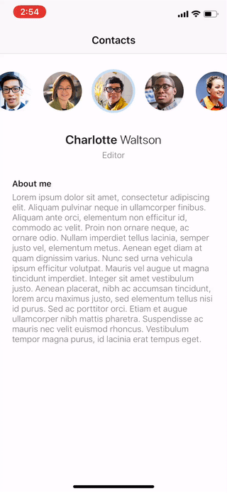

# iOS Engineer Challenge

Thank you for your interest in the Outlook Mobile iOS team! The interview process generally consists of two parts.

The first part is completing this coding challenge. This is your chance to show off your programming skills. As a result, we ask fewer technical questions during our interviews.

The second part is an on-site interview. In this interview, we may ask you questions about your project, and a couple of technical questions, but most of the focus is on making sure we will be a good fit.

Please complete this challenge and send a zip copy to your recruiting contact.

## Requirements

- Don't be afraid to cut some features if you need to. The priority should always be on showing off great code, over breadth of features. A comment explaining what you didn't have time to implement, and some of your thoughts, is always appreciated. 
- Please avoid using 3rd-party libraries: we want to see your code and problem solving. 
- Please minimize your use of xibs/storyboards: we're interested to see how you organize your view hierarchy, lay out your views, and structure your project. We find an overreliance on xibs and storyboards often hides this.
- Swift is the preferred language, but Objective-C is also accepted.

## Contacts App

The challenge is to build an iOS app that replicates the above app. We've provided some assets to assist you:

- A longer [video of the Contacts app](challenge.mov)
- [High-res screenshot](contact-hires.jpg)
- Some app resources to embed:
  - [contacts.json](contacts.json) 
  - [avatars.zip](avatars.zip)
